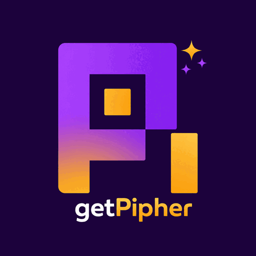

<p align="center">
  
</p>

<h1 align="center">getpipher</h1>

<p align="center">
  The <strong>Pi</strong> coding-agent ecosystem — extensions, skills, and tools built for and with
  <a href="https://github.com/earendil-works/pi-coding-agent">Pi</a>.
  Terminal-native, agent-first, open source.
</p>

<p align="center">
  <a href="https://pi.dev/packages"></a>
  <a href="https://github.com/earendil-works/pi-coding-agent"></a>
  <a href="LICENSE"></a>
</p>

---

This is the org-level profile repository for **getpipher**. Its `README.md` renders as the
organization profile at [github.com/getpipher](https://github.com/getpipher), and the brand assets
under [`assets/`](./assets) are the single source of truth for logos used across our packages.

## Packages

| Repo | What | Install |
| --- | --- | --- |
| [**zai-media**](https://github.com/getpipher/zai-media) | Z.AI media tools — image generation (GLM-Image) + OCR (GLM-OCR) as agent tools | `pi install git:github.com/getpipher/zai-media` |
| [**armory**](https://github.com/getpipher/armory) | CIPHER's pi extensions — custom tools, editor components, capability bridges | `pi install git:github.com/getpipher/armory` |
| [**armory-todo**](https://github.com/getpipher/armory-todo) | Global, cross-session TODO that persists across all sessions | `pi install git:github.com/getpipher/armory-todo` |
| [**arsenal**](https://github.com/getpipher/arsenal) | Public skill library — Solana, quality gates, git workflows, infra playbooks | `pi install git:github.com/getpipher/arsenal` |
| [**pimuster**](https://github.com/getpipher/pimuster) | Terminal-native team OS for one human + many AI agents | — |
| [**pi-package-index**](https://github.com/getpipher/pi-package-index) | Unofficial community index of Pi packages, with a public API | [pi-package-index.dev](https://pi-package-index.dev) |

## Brand assets

All sizes are losslessly optimized PNG8 (palette). The 953 KB original is **not** committed — GitHub
resizes the org avatar server-side, so the heavy source isn't needed here.

| File | Size | Use |
| --- | --- | --- |
| [`assets/logo.png`](./assets/logo.png) | 512px · 19 KB | **Default for READMEs, badges, npm, gallery** |
| [`assets/logo-1024.png`](./assets/logo-1024.png) | 1024px · 67 KB | High-DPI / retina contexts |
| [`assets/logo-256.png`](./assets/logo-256.png) | 256px · 5.3 KB | Favicons, list icons |

### Reference from your repo

```markdown

```

## Contributing

getpipher packages are MIT-licensed and open to contributions. Each package has its own contributing
notes in its repository. For org-wide questions, open a discussion or issue here.

## License

MIT © [getpipher](https://github.com/getpipher)
